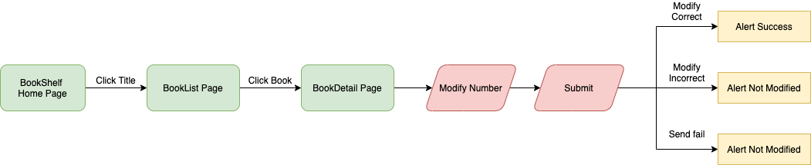

# bookshelf

## Demo
Link: https://fiona20072007.github.io/bookshell/

由於只使用 Github Pages，並沒有使用 firebase 或其他的網站部署，因此頁面無法支援重新整理。

原因：GitHub Pages 是完全靜態的 Server，網址對應到了真實的檔案路徑，當存取根目錄 / 時，預設的設定會去找 /index.html，當在 /[repo-name]/books 頁面重新整理時，dist資料夾內並沒有 /[repo-name]/books/index.html，所以會顯示 404 not found。

如要 clone 在本地測試，請使用 master branch 測試

步驟：

1. `git clone https://github.com/fiona20072007/bookshell.git`
2. cd 到該資料夾並 `npm install` (中間會有疑似停住的狀況，需耐心等待跑完就好)
3. `npm run serve`
4. 到 http://localhost:8080/bookshell/

## User Flow

到首頁後，點擊標題欄位進入到 BookList 頁面，可以左右滑動瀏覽所有書籍(小螢幕時可上下滑動)，點擊書本後底下會顯示價格與數量，左右按鍵可加減數目 1，或直接修改數字(不支援負數)，確認修改後會出現提示顯示是否修改成功。

整個專案沒有使用第三方 library，主要使用 Vue3 搭配 scss。

### 遇到的困難、問題，以及解決的方法

1. 在部署到 Github Page 出現 url 顯示錯誤，或是重新整理失敗的問題，原因在此文件上方有解釋，解決方式主要會使用 firebase 部署，並修改 host 設定對應到的頁面。
2. 在建立新專案時，由於是使用 webstorm 設定，因此預設是 vue 2.6 的版本，手動升級成 vue 3 的過程中遇到許多 dependency 無自動升級的問題，因此重新根據官方文檔建立 vue 3 專案。